# 🎓 Agentic Learner

**An Adaptive Educational System Using Specialized AI Agents**

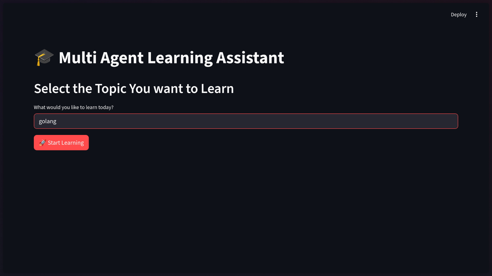

## 📋 Overview

Agentic Learner is an intelligent, multi-agent educational platform that revolutionizes personalized learning through AI. Built with seven specialized agents powered by Google's Gemini models, the system creates a complete learning cycle—from topic exploration to mastery verification—that adapts dynamically to each learner's performance.

Traditional learning platforms often fail to provide personalized assessment and adaptive content delivery. Agentic Learner addresses these limitations by distributing educational tasks across specialized AI agents, each optimized for specific functions, creating an experience that evolves with the learner's needs.

## ✨ Key Features

- 🤖 **Seven Specialized AI Agents** - Each agent handles a specific educational task with expert precision
- 📊 **Adaptive Learning Paths** - Content dynamically adjusts based on quiz performance and identified knowledge gaps
- 🎯 **Mastery-Based Progression** - Achieve 80%+ to unlock related topics and advance your learning journey
- 🎥 **Curated Video Content** - Automatic retrieval of relevant educational YouTube videos
- 📚 **Comprehensive Documentation** - AI-generated study materials with structured concepts and examples
- 💬 **Interactive Q&A** - Built-in chatbot for instant clarification and support
- 🔄 **Iterative Improvement Loop** - Focused quizzes on weak areas until mastery is achieved

## 🏗️ Architecture

### Multi-Agent System

The system employs seven specialized agents, each with a distinct role:

1. **Topic Selector Agent** - Refines user input into clear, specific learning topics
2. **Video Retriever Agent** - Fetches curated YouTube educational videos via scrapetube
3. **Documentation Generator Agent** - Creates comprehensive study materials with structured sections
4. **Quiz Generator Agent** - Produces adaptive multiple-choice assessments (5 questions per quiz)
5. **Evaluator Agent** - Analyzes performance, identifies knowledge gaps, and provides feedback
6. **Q&A Agent** - Offers interactive question-answering based on generated documentation
7. **Related Topics Agent** - Suggests five complementary topics after mastery achievement

### State Machine Workflow

```
Start → Topic Input → Fetch Content → Learning ⇄ [Chatbot Interactions]
                                           ↓
                                      Generate Quiz
                                           ↓
                                       Take Quiz
                                           ↓
                                        Evaluate
                                     ↙    ↓    ↘
                              Retake  Review  Mastery
                                              ↓
                                      Related Topics
```

### Adaptive Learning Mechanism

The system implements a sophisticated feedback loop:

1. **Performance Analysis** - Evaluator identifies incorrect answers and knowledge gaps
2. **Targeted Content** - Quiz Generator focuses 60%+ questions on weak concepts
3. **Iterative Improvement** - Process repeats until 80% mastery threshold is reached
4. **Progression Path** - Related topics unlock for continuous learning

## 🛠️ Technology Stack

- **Framework**: Streamlit (Interactive web UI)
- **Language**: Python 3.12
- **AI/ML**: 
  - Agno Framework (Agent orchestration)
  - Google Gemini 2.5 Flash (Primary model)
  - Google Gemini 2.5 Pro (Optional enhanced reasoning)
- **Content Retrieval**: Scrapetube (YouTube video scraping)
- **Async Processing**: Python asyncio for concurrent operations

## Screenshots


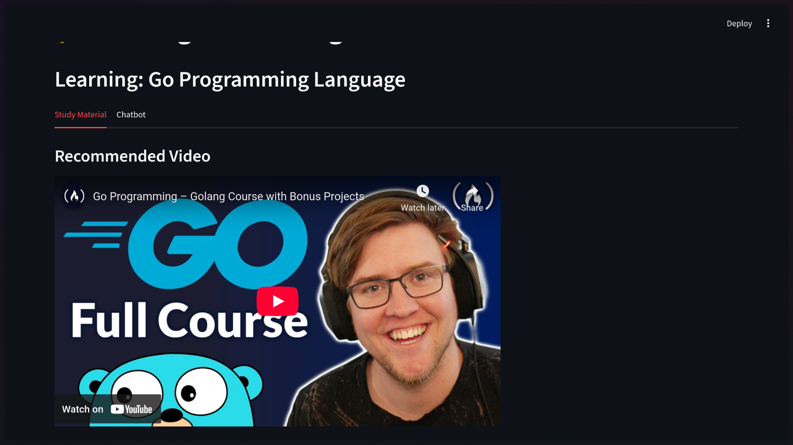
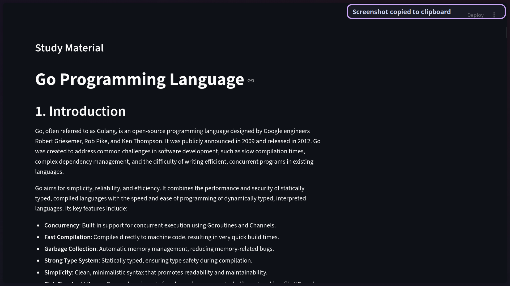
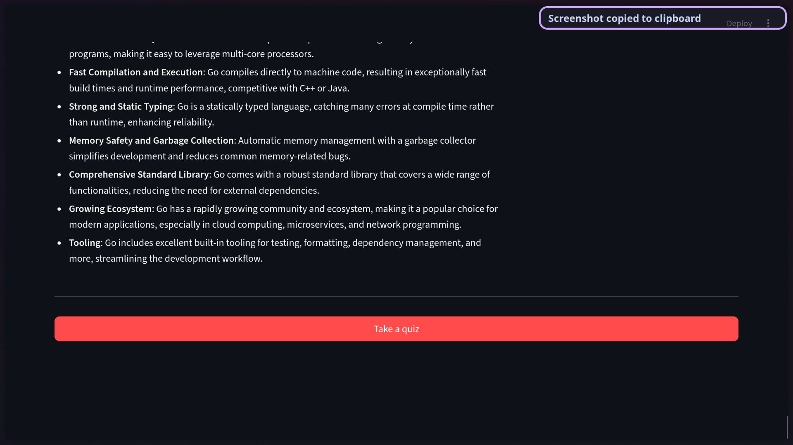
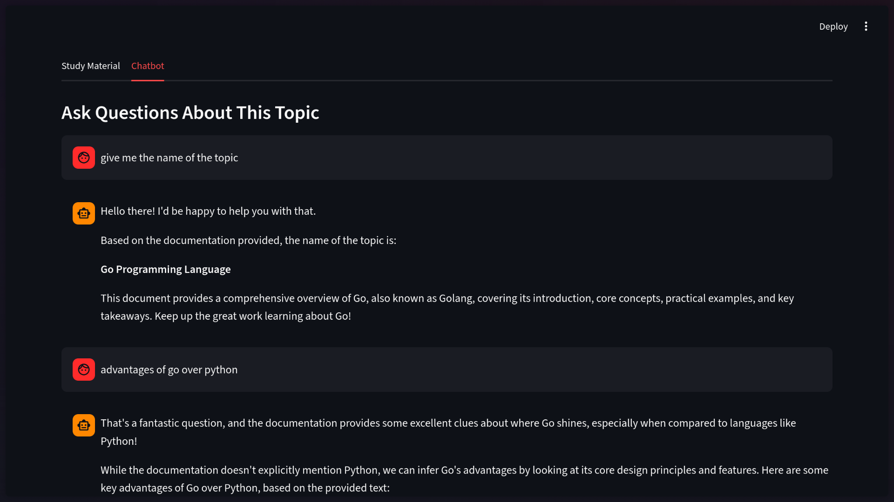
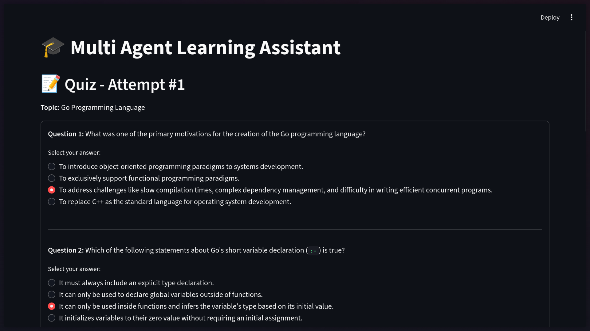
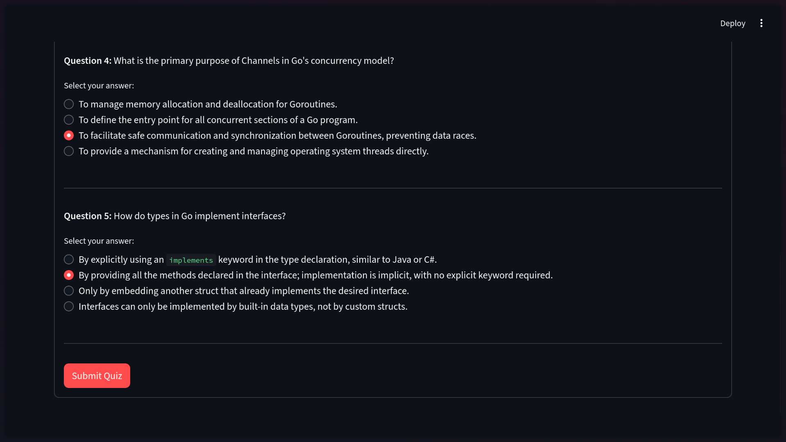
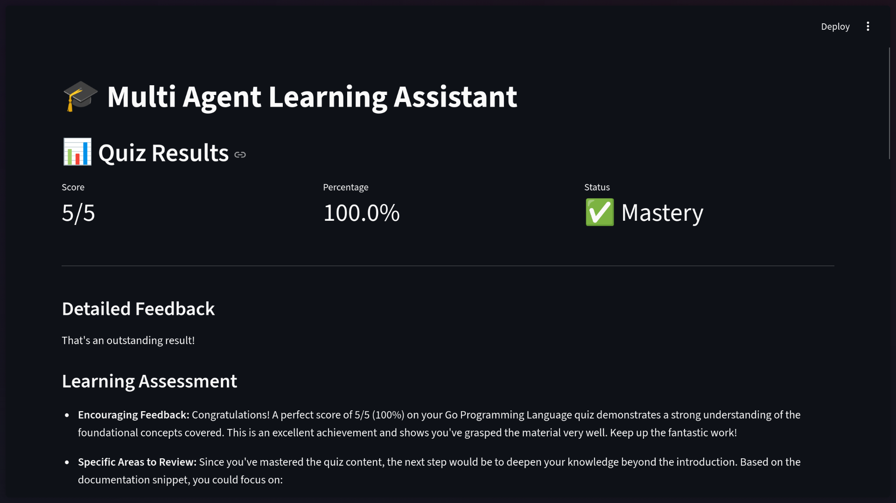
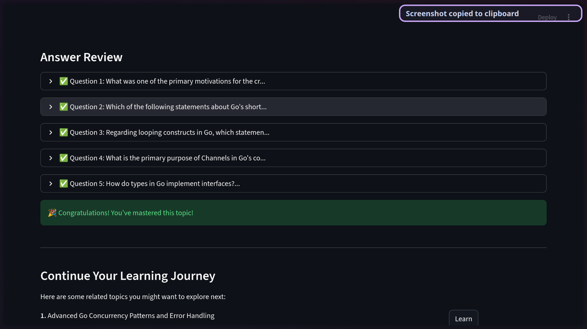
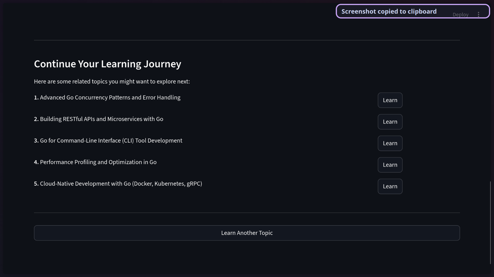
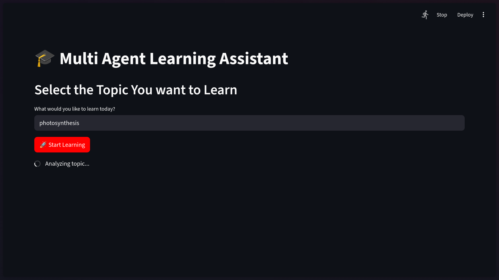
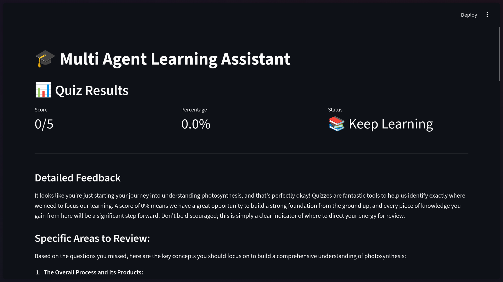
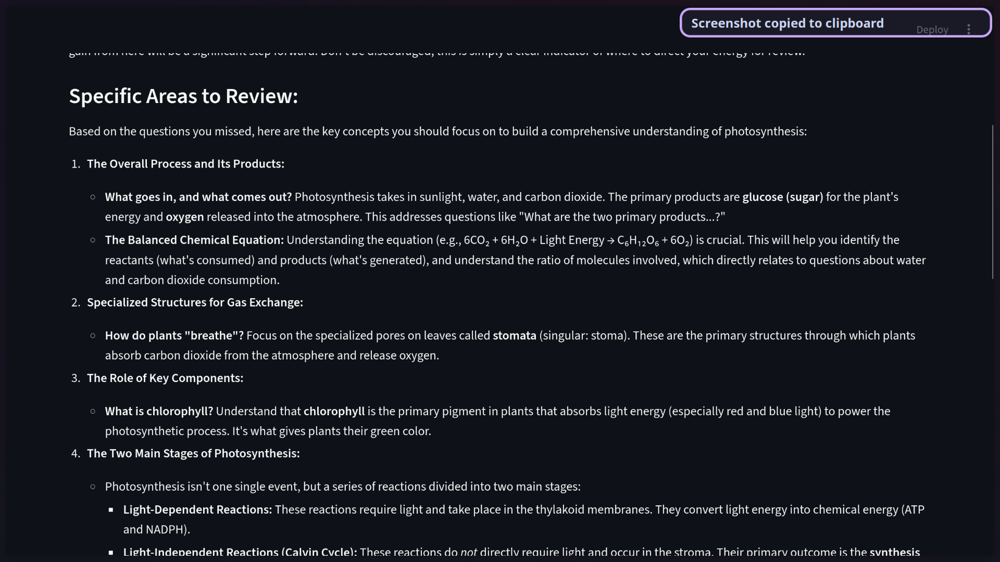
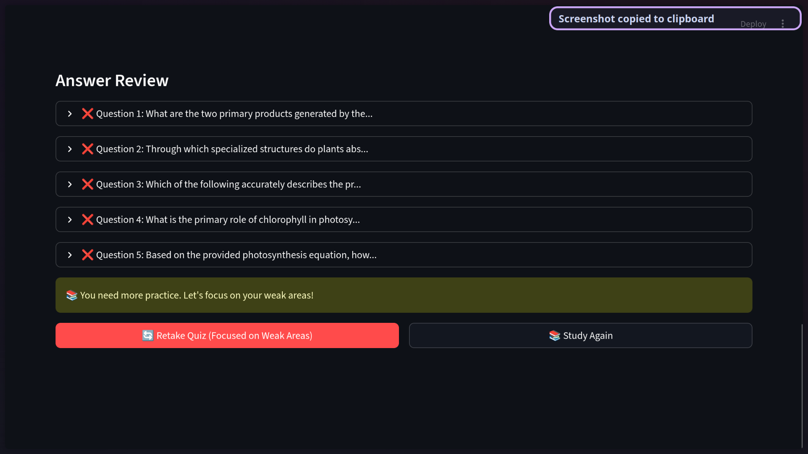

## 🚀 Getting Started

### Prerequisites

- Python 3.12 or higher
- Google Gemini API key

### Installation

1. Clone the repository:
```bash
git clone https://github.com/vivalchemy/agentic-learner.git
cd agentic-learner 
```

2. Install dependencies:
```bash
pip install -r requirements.txt
```

### Running the Application

```bash
streamlit run app.py
```

The application will open in your default browser at `http://localhost:8501`

## 📖 How It Works

1. **Enter a Topic** - Start by entering any subject you want to learn
2. **Study Materials** - Review AI-generated documentation and curated videos
3. **Ask Questions** - Use the built-in chatbot for clarification
4. **Take Quizzes** - Test your knowledge with adaptive assessments
5. **Get Feedback** - Receive detailed analysis of your performance
6. **Improve** - Retake focused quizzes on weak areas
7. **Achieve Mastery** - Score 80%+ to unlock related topics
8. **Continue Learning** - Explore suggested topics to expand your knowledge

## 📝 License

This project is open source and available under the [MIT License](LICENSE).

## 🙏 Acknowledgments

- Built with [Streamlit](https://streamlit.io/)
- Powered by [Google Gemini](https://deepmind.google/technologies/gemini/)
- Agent orchestration via [Agno Framework](https://agno.ai/)

---

⭐ If you find this project helpful, please consider giving it a star!
